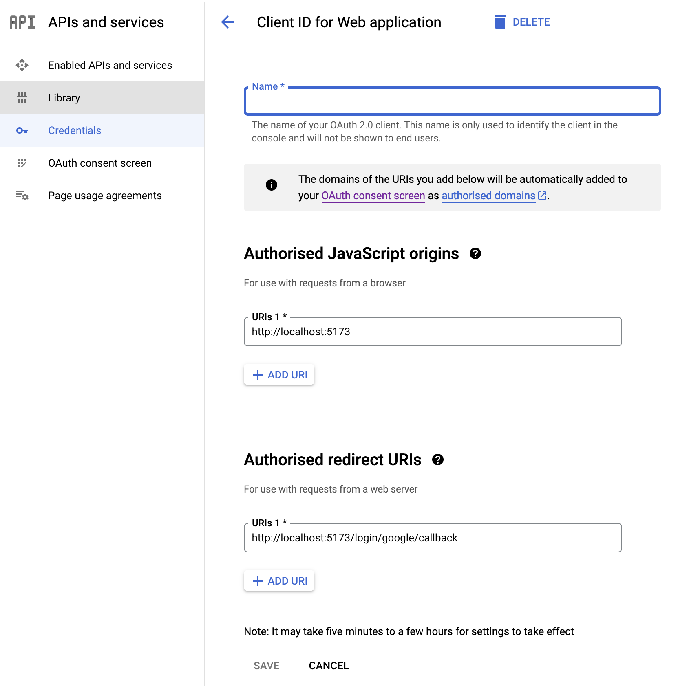
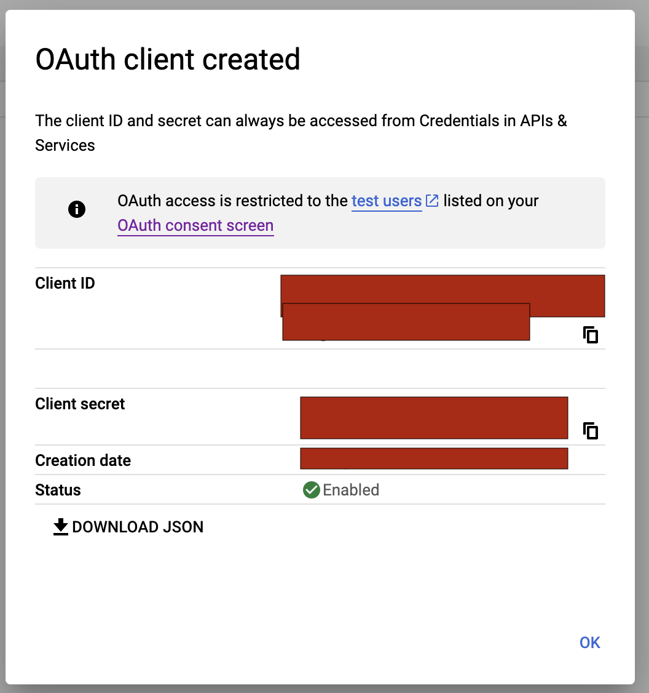

# Sveltekit Auth Starter

A [Sveltekit](https://github.com/sveltejs/kit#readme) starter template with built-in authentication and UI using [Lucia Auth](https://lucia-auth.com/).

It's quite limited at the moment, but it will get you started quickly with 3 Auth methods (Google/Github/Email+password).

[planetscale](https://planetscale.com) support only at the moment.

No built-in ORM. Gives you the freedom to integrate your own.

## Bugs / Feature requests / Community

You can report/discuss things via [github issues](https://github.com/TheCodingAtlas/sveltekit-auth-starter/issues), or more easier is to simply hit me up on [discord.](https://discord.gg/fKxa67EpnU)

## Getting Started

Clone > install deps > read docs!

|         |                                                                       |
| ------- | --------------------------------------------------------------------- |
| Clone   | `git clone git@github.com:TheCodingAtlas/sveltekit-auth-starter.git ` |
| Install | `pnpm install`                                                        |
| Develop | `pnpm start` (start the dev sever)                                    |
| Build   | `pnpm run build`                                                      |
| Preview | `pnpm run preview` (run the prod version locally)                     |

#### Database

Run the code from `mysql.sql` once you are connected to your planetscale database([tutorial](https://planetscale.com/docs/tutorials/connect-mysql-gui)) via [Sequal ace](https://sequel-ace.com/) and you are good to go.

#### NVM

Strongly recommend using [nvm](https://github.com/nvm-sh/nvm) and setting up [shell integration.](https://github.com/nvm-sh/nvm#deeper-shell-integration)

## Docs

The entire codebase is commented throughout, just dive in. If you have trouble understanding something, [hit me up](https://discord.gg/fKxa67EpnU) and I will help you.

### Features

- Github OAuth login/signup
- Google OAuth login/signup
- email/password login/signup
- Auto detecting e-mails across login methods and user linking.
- Logout hook
- profile page (barebones, just for debugging at the moment)
- basic styling ('inspired' by everybodys darling [linear](https://linear.app/))

### Notable changes

There are some changes I made in comparison to Lucia.

- My database tables are plural.
- renamed `user_keys` to `user_providers`. It makes more sense as they talk about OAuth `providers` in their docs.

## Github OAuth keys

**You will need separate OAuth apps for Local/Production!**

1. [Create a Github OAuth app](https://docs.github.com/en/apps/oauth-apps/building-oauth-apps/creating-an-oauth-app).
2. FIll in details as below including your app name


3. Copy and paste the client id and client secret into your .env file:

```
# .env
GITHUB_CLIENT_ID="..."
GITHUB_CLIENT_SECRET="..."
```

## Google OAuth keys

**You will need separate OAuth apps for Local/Production!**

[google tutorial](https://support.google.com/cloud/answer/6158849?hl=en)

For local testing you can blast through the setup using the steps below.

If you want to go live you will have to do more setup work.

### OAuth consent setup

#### 1. OAuth consent screen

- Fill in `App name`
- Fill in User `support email`
- Add `Developer contact information email` all the way below


#### 2. Scopes

- Click `add or remove scopes`
- Select the `scopes` as in the img and save


#### 3. Test users

- Add a test user email address so it will allow you to use google OAuth when testing locally.


#### 4. Summary

- nothing special, just click `back to dashboard` button below.

### Create OAuth Key

- Click on the `Credentials` item in the siderbar
- Click `CREATE CREDENTIALS`
- Click `OAuth client ID`


#### 1. App type

- Select `Web application`


#### 2. Details

- App name: `[myapp]-local`
- URL: `http://localhost:5173`
- Redirect url: `http://localhost:5173/login/google/callback`
- Click save



#### 3. Keys

- Copy and paste the `client id` and `client secret` from the popup into your .env file:



```
# .env
GOOGLE_OAUTH_CLIENT_ID="..."
GOOGLE_OAUTH_CLIENT_SECRET="..."
GOOGLE_OAUTH_REDIRECT_URI="..."
```

## Roadmap

**[No roadmap yet]**

Ideas:

- Implement lucia's password reset [example](https://lucia-auth.com/guidebook/password-reset-link)
- Supabase / Sqlite support for more options
- Build out profile page with editing
- Soft-Delete user functionality
- Email system example for sending out auth emails?
- Deployment documentation for various platforms? (Vercel/...)?
- ORM/Query builder built-in support?
  - There are so many and haven't found one that I truly like. I still roll raw queries most of the time.
  - [Drizzle ORM](https://github.com/drizzle-team/drizzle-orm) has caught my eye as an orm, and [Kysely](https://kysely.dev/) as well.
- Use a UI lib/tailwind instead of custom styling?

## License

[MIT](LICENSE)
